# Caribbean Domino Game Flow Diagram

This diagram illustrates the complete gameplay flow for Caribbean domino games, based on the rules documented in DOMINO_RULES.md.

## Mermaid Diagram

```mermaid
graph TD
    A["🎮 Game Setup"] --> B["Draw 7 Dominoes Each"]
    B --> C{"First Game?"}
    C -->|Yes| D["Player with Double-Six (6-6) Starts"]
    C -->|No| E["Previous Round Winner Starts"]

    D --> F["Play Double-Six First"]
    E --> F
    F --> G["🎯 Turn Sequence (Counter-Clockwise)"]

    G --> H{"Can Play Matching Domino?"}
    H -->|Yes| I["Play Domino to Either End"]
    H -->|No| J{"2-3 Players?"}

    J -->|Yes| K["Draw from Boneyard"]
    J -->|No| L["Pass Turn"]

    K --> M{"Drew Playable Domino?"}
    M -->|Yes| I
    M -->|No| L

    I --> N["Next Player Turn"]
    L --> N
    N --> O{"Round End Condition?"}

    O -->|No| H
    O -->|Yes| P["🏆 Determine Round Winner"]

    P --> Q{"How Did Round End?"}
    Q -->|Player Goes Out| R["Winner: Player Who Emptied Hand<br/>Points: Sum of Others Remaining Dominoes"]
    Q -->|Blocked Game| S["Winner: Lowest Total Spots<br/>Points: Sum of ALL Others Dominoes"]

    R --> T["🎲 Calculate Bonus Points"]
    S --> T

    T --> U["Double Out: +50 pts<br/>Domino (no draw): +25 pts<br/>Block Win: +25 pts<br/>Shutout: +100 pts"]

    U --> V["Add Points to Cumulative Score"]
    V --> W{"Reached Target Score?"}

    W -->|No| X["Start New Round"]
    W -->|Yes| Y["🎉 Game Winner!"]

    X --> E

    Z["📊 Scoring Systems"] --> Z1["100 Points: Quick Game"]
    Z --> Z2["200 Points: Traditional Doscientos"]
    Z --> Z3["500 Points: Extended with Bonuses"]
    Z --> Z4["Partnership: First to 6 Hands (4 Players)"]
    Z --> Z5["Chiva: 4 Consecutive Wins"]

    AA["🎯 Special Rules"] --> AA1["First Round Bonus: +100 pts (500pt game)"]
    AA --> AA2["Reset Rule: Losing team win resets to 0-0"]
    AA --> AA3["Key Bone: 2 pts for last playable when blocked"]

    classDef setup fill:#74c0fc,stroke:#339af0,color:#000
    classDef gameplay fill:#51cf66,stroke:#2f9e44,color:#fff
    classDef scoring fill:#ffd43b,stroke:#fab005,color:#000
    classDef decision fill:#ff922b,stroke:#e8590c,color:#fff
    classDef ending fill:#845ef7,stroke:#5f3dc4,color:#fff
    classDef rules fill:#ff8cc8,stroke:#e64980,color:#fff

    class A,B,C,D,E,F setup
    class G,H,I,J,K,L,M,N,O gameplay
    class P,Q,R,S,T,U,V,W scoring
    class X,Y ending
    class Z,Z1,Z2,Z3,Z4,Z5,AA,AA1,AA2,AA3 rules
```

## Color Legend

- **Blue (Setup)**: Initial game setup and starting conditions
- **Green (Gameplay)**: Core turn-by-turn gameplay mechanics
- **Yellow (Scoring)**: Point calculation and round completion
- **Orange (Decisions)**: Key decision points that affect game flow
- **Purple (Ending)**: Game completion and winner determination
- **Pink (Rules)**: Special rules and scoring variations

## Usage

This diagram can be viewed in any Markdown renderer that supports Mermaid diagrams, including:

- GitHub (native Mermaid support)
- VS Code with Mermaid extensions
- Online Mermaid editors
- Documentation sites like GitBook or Notion

## Implementation Notes

The diagram directly corresponds to the game logic implemented in:

- `src/utils/gameLogic.ts` - Core game engine functions
- `src/types/gameCore.ts` - TypeScript interfaces for game state
- `src/data/gameTemplates.ts` - Rule variations and scoring systems
